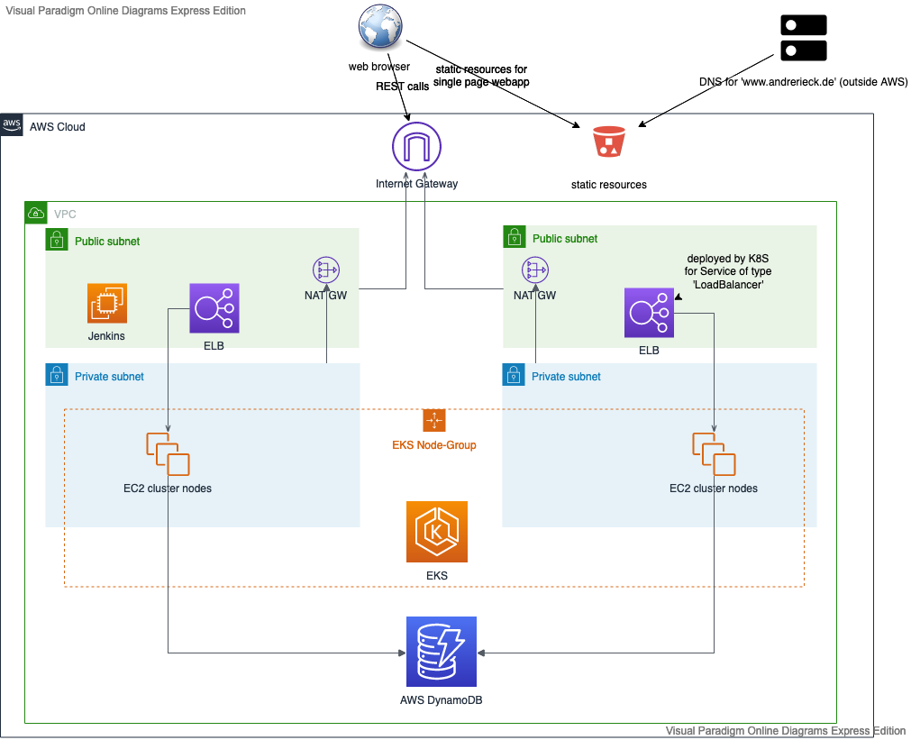

# Udacity-Cloud-DevOps-Capstone-Project

As an example a small ToDo-List application called 'Andre´s TODO' has been developed
which is accessible under [andrerieck.de](http://www.andrerieck.de) 

#### Technologies used 

- ***CI/CD*** Jenkins
- ***Frontend*** *Vue.js* with the *Element* UI-library. Vue app is deployed by the Jenkins pipeline to an S3-Bucket from which the static resources are served.
- ***Backend*** : REST Services provided via a *Spring-Boot* backend deployed to an *EKS managed K8S cluster*. 
- ***Container orchestration platform*** AWS EKS managed K8S cluster.
- ***Container registry*** *AWS ECR*
- ***Persistence*** *AWS DynamoDB*
- ***User Management*** *AWS Cognito*
K8S Cluster
- ***infrastructure provisionsing*** AWS cloudformation

#### overview over AWS infrastructure

#### CI/CD Pipeline

The CI/CD pipeline has the steps as show by the following image and is defined using a *Jenkinsfile*


The ***Jenkins*** instance has been provisioned manually on an EC2 instance.
The following tools need to be available on then jenkins instance :

* yarn
* node  
* vue-cli
* maven
* openjdk 14
* docker
* aws cli
* kubectl  

## Infrastructure setup



The app is deployed within it's on VPC which contains two public and two
private subnets which are assigned to two different Availability Zones
respectively.

The public subnets will house the ELB-Nodes deployed by the EKS cluster for
the service of type LoadBalancer that provides the REST-Endpoint to the internet. In addition two NAT-Gateways are deployed to the public subnets
so that Nodes in the private subnets can access the internet in order to
update etc.

The REST backend is provided by a containerised Spring Boot application deployed to an EKS managed K8S cluster. The clusters nodes are managed
by a Node Group that maintains a set of EC2 nodes spinned up in both private
subnets.

### Cloudformation setup
The Infrastructure is deployed using Cloud-formation using CF-yml files
and scripts found in the ***infrastructure*** folder.

Overview of the most important resources declared by the CF-scripts :

- infrastructure.yaml
   - ToDoDynamoDbTable (AWS::DynamoDB::Table)
     This is where the ToDo-Items are stored.
   - StaticResourcesBucket (AWS::S3::Bucket)
     This is the S3 bucket configured for static web hosting which is
     used to serve the static resources of the javascript frontend.
   - CognitoUserPool (AWS::Cognito::UserPool)
     The AWS Cognito user pool used to manage app users.

- amazon-eks-vpc-private-subnets.yaml
   - VPC (AWS::EC2::VPC)
     The VPC where the ToDo app will be hosted
   - InternetGateway (AWS::EC2::InternetGateway)
     Provides inbound/outbound internet traffic for the resources of the VPC e.g. the ELB, the worker nodes etc.
   - PublicRouteTable, PrivateRouteTable01 and PrivateRouteTable02 (AWS::EC2::RouteTable)
     Route tables for the subnets of the VPC.
   - NatGateway01 and NatGateway02
     NAT Gateways providing outbound traffic to the internet for nodes within private subnet 1 and 2.
   - PublicSubnet01, PublicSubnet01, PrivateSubnet01 and PrivateSubnet02
     The public and private subnets of the VPC.

- amazon-eks-cluster.yaml
   - EksServiceRole (AWS::IAM::Role)   
     This is the Role EKS needs in order to create the Resources for new K8S Clusters
   - NodeInstanceRole (AWS::IAM::Role)  
     This is the role the K8S worker nodes need to talk to the control plane and to pull images from ecr etc.
   - K8SCluster (AWS::EKS::Cluster)
     Creates the K8S control plane of the K8S cluster
   - K8SClusterNodegroup (AWS::EKS::Nodegroup) 
     Creates the node group that creates and maintains the worker nodes for the K8S cluster.

#### Using createInfrastructure.sh and updateInfrastructure.sh 
 
In order to create and update the infrastructure using cloudformation the two scripts createInfrastructure.sh and updateInfrastructure.sh can be used.
Each script uses the aws cli to create/update the three stacks
one after the other.

##### configuring kubectl for a new EKS Cluster

After the EKS K8S cluster has been created only the IAM user that created the cluster
can access the cluster via kubectl.

If the kubectl cli that is used to manage the cluster (e.g. on local dev laptops or on jenkins) 
should use a different IAM user it is necessary to authorize this IAM accordingly in the cluster :

- determine the IAM user used by the aws cli using : `aws sts get-caller-identity`. The currently active IAM user will be the user accessing the cluster via kubectl after the aws-cli is used to configure kubectl.
- use the aws cli to configure kubectl to use the created k8s cluster `aws eks --region region-code update-kubeconfig --name <cluster_name>` (cluster_name will be ***todoapp*** for this app)
- IAM users that are allowed to manage the cluster will be configured using a kubernetes config-map named 'aws-auth'.
In order to apply this configuration it is necessary to access the cluster using the IAM user that created the cluster. Using this user execute `kubectl describe configmap -n kube-system aws-auth` to check whether this configmap is present (if this is not the case the procedure to create this configmap is documented here : https://docs.aws.amazon.com/eks/latest/userguide/add-user-role.html)
In order to add an IAM user to this configmap the following command can be used to add an IAM user `kubectl edit -n kube-system configmap/aws-auth`. New IAM user that should be allowed to manage the cluster have to be added to the ***mapUsers*** section as in the following example :

```
    apiVersion: v1
    data:
    mapRoles: |
    - rolearn: <ARN of instance role (created by the EksServiceRole cloudformation resource)>
      username: system:node:{{EC2PrivateDNSName}}
      groups:
        - system:bootstrappers
        - system:nodes
    mapUsers: |
    - userarn: arn:aws:iam::277642653139:user/jenkins-nanodegree
      username: pipeline
      groups:
        - system:masters
```
